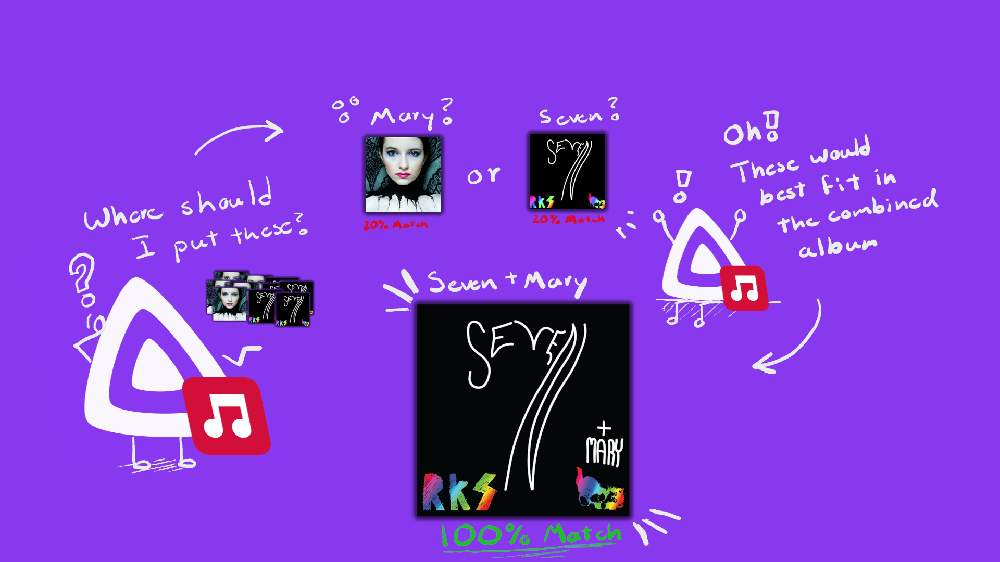

<p align="center">
  
</p>

# MusicFin: Smarter Music Tagging

Problem: most music taggers ***kinda suck***.

They don't take into context the full album when identifying tracks so your music collection looks like this:

<p align="center">
  
</p>

I got tired of manually sorting tracks and made a plugin that identifies an artists' full discographies and sorts the tracks into the most logical order:

<p align="center">
  
</p>
Finally, I have music that's sorted correctly!

- Works with Singles & EPs!

- Works with combo-albums!

- Works even if you don't have the full album!

- Works with "Live" albums!

- Auto sorts singles and EPs when an artist releases a new album!


## Installing
**Step 1**
<p align="center">
  
</p>

**Dashboard --> Plugins --> Manage Repositories** --> **+ New Repository**:
   - Name: `FinPlugins` (or whatever :P )
   - URL: `https://raw.githubusercontent.com/TidBits16/FinPlugins/main/manifest.json`
   <br>
   (p.s. this bundle includes my other FinPlugins since they are designed to work together. ***they are not required to install!***)
<br>
<center><strong>**Then Restart JellyFin!**</strong></center>

**Step 2**
<p align="center">
  
</p>

**Plugins** --> **All** --> **MusicFin: Smarter Music Tagging** --> **Install**

<center><strong>**Once Installed, Restart JellyFin Again!**</strong></center>

## Build Locally

For development or packaging your own build:

```bash
dotnet build Jellyfin.Plugin.DeezerTagger.csproj -c Release
./scripts/package.sh
```

The release zip will be in `dist/`.

Designed for **Jellyfin 10.11+** (you probably have this already :D)
<p align="center">
  <a href="https://github.com/TidBits16/FinPlugins">
    
  </a>
</p>
<p align="center"><a href="https://github.com/TidBits16/FinPlugins">Check out these other plugins!</a></p>